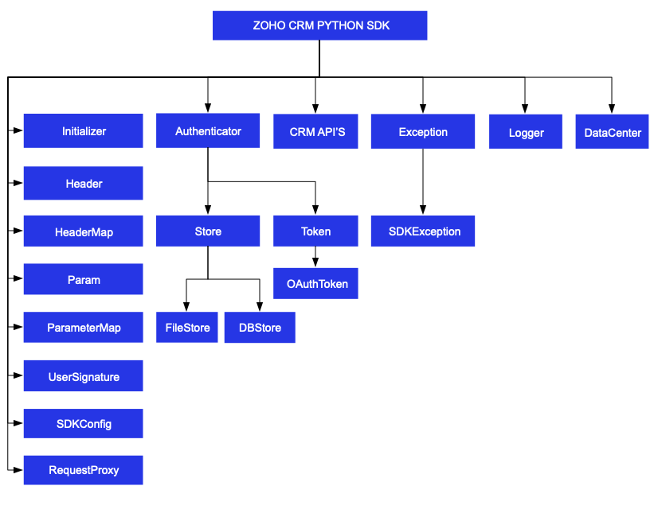

#  ZOHO CRM PYTHON SDK

## Table Of Contents

* [Overview](#overview)
* [Registering a Zoho Client](#registering-a-zoho-client)
* [Environmental Setup](#environmental-setup)
* [Including the SDK in your project](#including-the-sdk-in-your-project)
* [Persistence](#token-persistence)
  * [DataBase Persistence](#database-persistence)
  * [File Persistence](#file-persistence)
  * [Custom Persistence](#custom-persistence)
* [Configuration](#configuration)
* [Initialization](#initializing-the-application)
* [Class Hierarchy](#class-hierarchy)
* [Responses And Exceptions](#responses-and-exceptions)
* [Threading](#threading-in-the-python-sdk)
  * [Multithreading in a Multi-User App](#multithreading-in-a-multi-user-app)
  * [Multi-threading in a Single User App](#multi-threading-in-a-single-user-app)
* [Sample Code](#sdk-sample-code)

## Overview

Zoho CRM PYTHON SDK offers a way to create client Python applications that can be integrated with Zoho CRM.

## Registering a Zoho Client

Since Zoho CRM APIs are authenticated with OAuth2 standards, you should register your client app with Zoho. To register your app:

- Visit this page [https://api-console.zoho.com](https://api-console.zoho.com)

- Click on `ADD CLIENT`.

- Choose a `Client Type`.

- Enter **Client Name**, **Client Domain** or **Homepage URL** and **Authorized Redirect URIs** then click `CREATE`.

- Your Client app would have been created and displayed by now.

- Select the created OAuth client.

- Generate grant token by providing the necessary scopes, time duration (the duration for which the generated token is valid) and Scope Description.

## Environmental Setup

Python SDK is installable through **pip**. **pip** is a tool for dependency management in Python. SDK expects the following from the client app.

- Client app must have Python(version 3 and above)

- Python SDK must be installed into client app through **pip**.

## Including the SDK in your project

You can include the SDK to your project using:
- Install **Python** from [python.org](https://www.python.org/downloads/) (if not installed).

- Install **Python SDK**
    - Navigate to the workspace of your client app.
    - Run the command below:

    ```sh
    pip install zcrmsdk==3.x.x
    ```
- The Python SDK will be installed in your client application.

## Token Persistence

Token persistence refers to storing and utilizing the authentication tokens that are provided by Zoho. There are three ways provided by the SDK in which persistence can be utilized. They are DataBase Persistence, File Persistence and Custom Persistence.

### Table of Contents

- [DataBase Persistence](#database-persistence)

- [File Persistence](#file-persistence)

- [Custom Persistence](#custom-persistence)

### Implementing OAuth Persistence

Once the application is authorized, OAuth access and refresh tokens can be used for subsequent user data requests to Zoho CRM. Hence, they need to be persisted by the client app.

The persistence is achieved by writing an implementation of the inbuilt Abstract Base Class **[TokenStore](zcrmsdk/src/com/zoho/api/authenticator/store/token_store.py)**, which has the following callback methods.

- **get_token(self, user, [token](zcrmsdk/src/com/zoho/api/authenticator/token.py))** - invoked before firing a request to fetch the saved tokens. This method should return implementation of inbuilt **Token Class** object for the library to process it.

- **save_token(self, user, [token](zcrmsdk/src/com/zoho/api/authenticator/token.py))** - invoked after fetching access and refresh tokens from Zoho.

- **delete_token(self, [token](zcrmsdk/src/com/zoho/api/authenticator/token.py))** - invoked before saving the latest tokens.

- **get_tokens(self)** - The method to get the all the stored tokens.

- **delete_tokens(self)** - The method to delete all the stored tokens.

Note:

- user is an instance of UserSignature Class.

- token is an instance of Token Class.

### DataBase Persistence

In case the user prefers to use default DataBase persistence, **MySQL** can be used.

- The database name should be **zohooauth**.

- There must be a table name **oauthtoken** with the following columns.

  - id int(11)

  - user_mail varchar(255)

  - client_id varchar(255)

  - refresh_token varchar(255)

  - access_token varchar(255)

  - grant_token varchar(255)

  - expiry_time varchar(20)

#### MySQL Query

```sql
create table oauthtoken(id int(11) not null auto_increment, user_mail varchar(255) not null, client_id varchar(255), refresh_token varchar(255), access_token varchar(255), grant_token varchar(255), expiry_time varchar(20), primary key (id));

alter table oauthtoken auto_increment = 1;
```

#### Note
The Database persistence requires the following libraries
- [mysql-connector](https://pypi.org/project/mysql-connector/)
- [mysql-connector-python](https://pypi.org/project/mysql-connector-python/)

#### Create DBStore object

```python
from zcrmsdk.src.com.zoho.api.authenticator.store import DBStore
"""
DBStore takes the following parameters
1 -> DataBase host name. Default value "localhost"
2 -> DataBase name. Default value "zohooauth"
3 -> DataBase user name. Default value "root"
4 -> DataBase password. Default value ""
5 -> DataBase port number. Default value "3306"
"""
store = DBStore()

store = DBStore(host='host_name', database_name='database_name', user_name='user_name', password='password', port_number='port_number')
```

### File Persistence

In case of File Persistence, the user can persist tokens in the local drive, by providing the absolute file path to the FileStore object.

- The File contains

    - user_mail

    - client_id

    - refresh_token

    - access_token

    - grant_token

    - expiry_time

#### Create FileStore object

```python
from zcrmsdk.src.com.zoho.api.authenticator.store import FileStore
"""
FileStore takes the following parameter
1 -> Absolute file path of the file to persist tokens
"""
store = FileStore(file_path='/Users/username/Documents/python_sdk_token.txt')
```

### Custom Persistence
To use Custom Persistence, the user must implement the Abstract Base Class **[TokenStore](zcrmsdk/src/com/zoho/api/authenticator/store/token_store.py)** and override the methods.

```python
from zcrmsdk.src.com.zoho.api.authenticator.store import TokenStore


class CustomStore(TokenStore):

    def __init__(self):
        pass

    def get_token(self, user, token):

        """
        Parameters:
            user (UserSignature) : A UserSignature class instance.
            token (Token) : A Token (zcrmsdk.src.com.zoho.api.authenticator.OAuthToken) class instance
        """

        # Add code to get the token
        return None

    def save_token(self, user, token):

        """
        Parameters:
            user (UserSignature) : A UserSignature class instance.
            token (Token) : A Token (zcrmsdk.src.com.zoho.api.authenticator.OAuthToken) class instance
        """

        # Add code to save the token

    def delete_token(self, token):

        """
        Parameters:
            token (Token) : A Token (zcrmsdk.src.com.zoho.api.authenticator.OAuthToken) class instance
        """

        # Add code to delete the token
    
    def get_tokens():

        """
        Returns:
            list: List of stored tokens
        """

        # Add code to get all the stored tokens
    
    def delete_tokens():

        # Add code to delete all the stored tokens

```

## Configuration

Before you get started with creating your Python application, you need to register your client and authenticate the app with Zoho.

- Create an instance of **Logger** Class to log exception and API information.
  ```python
    from zcrmsdk.src.com.zoho.api.logger import Logger
  
    """
    Create an instance of Logger Class that takes two parameters
    1 -> Level of the log messages to be logged. Can be configured by typing Logger.Levels "." and choose any level from the list displayed.
    2 -> Absolute file path, where messages need to be logged.
    """
    logger = Logger.get_instance(level=Logger.Levels.INFO, file_path="/Users/user_name/Documents/python_sdk_log.log")
    ```

- Create an instance of **UserSignature** Class that identifies the current user.
  ```python
  from zcrmsdk.src.com.zoho.crm.api.user_signature import UserSignature

  # Create an UserSignature instance that takes user Email as parameter
  user = UserSignature(email='abc@zoho.com')
  ```

- Configure API environment which decides the domain and the URL to make API calls.
  ```python
  from zcrmsdk.src.com.zoho.crm.api.dc import USDataCenter

  """
  Configure the environment
  which is of the pattern Domain.Environment
  Available Domains: USDataCenter, EUDataCenter, INDataCenter, CNDataCenter, AUDataCenter
  Available Environments: PRODUCTION(), DEVELOPER(), SANDBOX()
  """
  environment = USDataCenter.PRODUCTION()
  ```

- Create an instance of OAuthToken with the information that you get after registering your Zoho client.
  ```python
  from zcrmsdk.src.com.zoho.api.authenticator.oauth_token import OAuthToken, TokenType

  """
  Create a Token instance that takes the following parameters
  1 -> OAuth client id.
  2 -> OAuth client secret.
  3 -> REFRESH/GRANT token.
  4 -> token type.
  5 -> OAuth redirect URL. Default value is None
  """
  token = OAuthToken(client_id='clientId', client_secret='clientSecret', token='REFRESH/ GRANT Token', token_type=TokenType.REFRESH / TokenType.GRANT, redirect_url='redirectURL')
  ```

- Create an instance of [TokenStore](zcrmsdk/src/com/zoho/api/authenticator/store/token_store.py) to persist tokens, used for authenticating all the requests.
  ```python
  from zcrmsdk.src.com.zoho.api.authenticator.store import DBStore, FileStore

  """
  DBStore takes the following parameters
  1 -> DataBase host name. Default value "localhost"
  2 -> DataBase name. Default value "zohooauth"
  3 -> DataBase user name. Default value "root"
  4 -> DataBase password. Default value ""
  5 -> DataBase port number. Default value "3306"
  """
  store = DBStore()

  #store = DBStore(host='host_name', database_name='database_name', user_name='user_name', password='password', port_number='port_number')

  """
  FileStore takes the following parameter
  1 -> Absolute file path of the file to persist tokens
  """
  #store = FileStore(file_path='/Users/username/Documents/python_sdk_tokens.txt')
  ```

- Create an instance of **[SDKConfig](zcrmsdk/src/com/zoho/crm/api/sdk_config.py)** containing the SDK Configuration.
  ```python
  from zcrmsdk.src.com.zoho.crm.api.sdk_config import SDKConfig

  """
  auto_refresh_fields (Default value is False)
    if True - all the modules' fields will be auto-refreshed in the background, every hour.
    if False - the fields will not be auto-refreshed in the background. The user can manually delete the file(s) or refresh the fields using methods from ModuleFieldsHandler(zcrmsdk/src/com/zoho/crm/api/util/module_fields_handler.py)

  pick_list_validation (Default value is True)
    A boolean field that validates user input for a pick list field and allows or disallows the addition of a new value to the list.
    if True - the SDK validates the input. If the value does not exist in the pick list, the SDK throws an error.
    if False - the SDK does not validate the input and makes the API request with the user’s input to the pick list
  """
  config = SDKConfig(auto_refresh_fields=True, pick_list_validation=False)
  ```

- The path containing the absolute directory path (in the key resource_path) to store user-specific files containing information about fields in modules. 
  ```python
  resource_path = '/Users/user_name/Documents/python-app'
  ```

- Create an instance of RequestProxy containing the proxy properties of the user.
    ```python
    from zcrmsdk.src.com.zoho.crm.api.request_proxy import RequestProxy

    """
    RequestProxy takes the following parameters
    1 -> Host
    2 -> Port Number
    3 -> User Name. Default value is None
    4 -> Password. Default value is an empty string
    """
    request_proxy = RequestProxy(host='proxyHost', port=80)
    request_proxy = RequestProxy(host='proxyHost', port=80, user='userName', password='password')
    ```

## Initializing the Application

Initialize the SDK using the following code.

```python
from zcrmsdk.src.com.zoho.crm.api.user_signature import UserSignature
from zcrmsdk.src.com.zoho.crm.api.dc import USDataCenter
from zcrmsdk.src.com.zoho.api.authenticator.store import DBStore, FileStore
from zcrmsdk.src.com.zoho.api.logger import Logger
from zcrmsdk.src.com.zoho.crm.api.initializer import Initializer
from zcrmsdk.src.com.zoho.api.authenticator.oauth_token import OAuthToken, TokenType
from zcrmsdk.src.com.zoho.crm.api.sdk_config import SDKConfig


class SDKInitializer(object):

    @staticmethod
    def initialize():

        """
        Create an instance of Logger Class that takes two parameters
        1 -> Level of the log messages to be logged. Can be configured by typing Logger.Levels "." and choose any level from the list displayed.
        2 -> Absolute file path, where messages need to be logged.
        """
        logger = Logger.get_instance(level=Logger.Levels.INFO, file_path='/Users/user_name/Documents/python_sdk_log.log')

        # Create an UserSignature instance that takes user Email as parameter
        user = UserSignature(email='abc@zoho.com')

        """
        Configure the environment
        which is of the pattern Domain.Environment
        Available Domains: USDataCenter, EUDataCenter, INDataCenter, CNDataCenter, AUDataCenter
        Available Environments: PRODUCTION(), DEVELOPER(), SANDBOX()
        """
        environment = USDataCenter.PRODUCTION()

        """
        Create a Token instance that takes the following parameters
        1 -> OAuth client id.
        2 -> OAuth client secret.
        3 -> REFRESH/GRANT token.
        4 -> token type.
        5 -> OAuth redirect URL.
        """
        token = OAuthToken(client_id='clientId', client_secret='clientSecret', token='REFRESH/ GRANT Token', token_type=TokenType.REFRESH / TokenType.GRANT, redirect_url='redirectURL')

        """
        Create an instance of TokenStore
        1 -> Absolute file path of the file to persist tokens
        """
        store = FileStore(file_path='/Users/username/Documents/python_sdk_tokens.txt')

        """
        Create an instance of TokenStore
        1 -> DataBase host name. Default value "localhost"
        2 -> DataBase name. Default value "zohooauth"
        3 -> DataBase user name. Default value "root"
        4 -> DataBase password. Default value ""
        5 -> DataBase port number. Default value "3306"
        """
        store = DBStore()
        store = DBStore(host='host_name', database_name='database_name', user_name='user_name', password='password',port_number='port_number')

        """
        auto_refresh_fields (Default value is False)
            if True - all the modules' fields will be auto-refreshed in the background, every hour.
            if False - the fields will not be auto-refreshed in the background. The user can manually delete the file(s) or refresh the fields using methods from ModuleFieldsHandler(zcrmsdk/src/com/zoho/crm/api/util/module_fields_handler.py)

        pick_list_validation (Default value is True)
        A boolean field that validates user input for a pick list field and allows or disallows the addition of a new value to the list.
            if True - the SDK validates the input. If the value does not exist in the pick list, the SDK throws an error.
            if False - the SDK does not validate the input and makes the API request with the user’s input to the pick list
        """
        config = SDKConfig(auto_refresh_fields=True, pick_list_validation=False)

        """
        The path containing the absolute directory path (in the key resource_path) to store user-specific files containing information about fields in modules. 
        """
        resource_path = '/Users/user_name/Documents/python-app'

        """
        Create an instance of RequestProxy class that takes the following parameters
        1 -> Host
        2 -> Port Number
        3 -> User Name. Default value is None
        4 -> Password. Default value is None
        """
        request_proxy = RequestProxy(host='host', port=8080)

        request_proxy = RequestProxy(host='host', port=8080, user='user', password='password')

        """
        Call the static initialize method of Initializer class that takes the following arguments
        1 -> UserSignature instance
        2 -> Environment instance
        3 -> Token instance
        4 -> TokenStore instance
        5 -> SDKConfig instance
        6 -> resource_path
        7 -> Logger instance. Default value is None
        8 -> RequestProxy instance. Default value is None
        """
        Initializer.initialize(user=user, environment=environment, token=token, store=store, sdk_config=config, resource_path=resource_path, logger=logger, proxy=request_proxy)


SDKInitializer.initialize()

```

- You can now access the functionalities of the SDK. Refer to the sample codes to make various API calls through the SDK.

## Class Hierarchy



## Responses and Exceptions

All SDK methods return an instance of the APIResponse class.

After a successful API request, the **get_object()** method returns an instance of the **ResponseWrapper** (for **GET**) or the **ActionWrapper** (for **POST, PUT, DELETE**)

Whenever the API returns an error response, the **get_object()** returns an instance of **APIException** class.

**ResponseWrapper** (for **GET** requests) and **ActionWrapper** (for **POST, PUT, DELETE** requests) are the expected objects for Zoho CRM APIs’ responses

However, some specific operations have different expected objects, such as the following:

- Operations involving records in Tags
    - **RecordActionWrapper**

- Getting Record Count for a specific Tag operation
    - **CountWrapper**

- Operations involving BaseCurrency
    - **BaseCurrencyActionWrapper**

- Lead convert operation
    - **ConvertActionWrapper**

- Retrieving Deleted records operation
    - **DeletedRecordsWrapper**

- Record image download operation
    - **FileBodyWrapper**

- MassUpdate record operations
    - **MassUpdateActionWrapper**
    - **MassUpdateResponseWrapper**
  
### GET Requests

- The **get_object()** returns an instance of one of the following classes, based on the return type.

    - For  **application/json** responses
        - **ResponseWrapper**
        - **CountWrapper**
        - **DeletedRecordsWrapper**
        - **MassUpdateResponseWrapper**
        - **APIException**

    - For **file download** responses
        - **FileBodyWrapper**
        - **APIException**

### POST, PUT, DELETE Requests

- The **getObject()** returns an instance of one of the following classes
    - **ActionWrapper**
    - **RecordActionWrapper**
    - **BaseCurrencyActionWrapper**
    - **MassUpdateActionWrapper**
    - **ConvertActionWrapper**
    - **APIException**

- These wrapper classes may contain one or a list of instances of the following classes, depending on the response.
    - **SuccessResponse Class**, if the request was successful.
    - **APIException Class**, if the request was erroneous.

For example, when you insert two records, and one of them was inserted successfully while the other one failed, the ActionWrapper will contain one instance each of the SuccessResponse and APIException classes.

All other exceptions such as SDK anomalies and other unexpected behaviours are thrown under the SDKException class.

## Threading in the Python SDK

Threads in a Python program help you achieve parallelism. By using multiple threads, you can make a Python program run faster and do multiple things simultaneously.

The **Python SDK** (from version 3.x.x) supports both single-user and multi-user app.

### Multithreading in a Multi-user App

Multi-threading for multi-users is achieved using Initializer's static **switch_user()** method.

```python
# without proxy
Initializer.switch_user(user=user, environment=environment, token=token, sdk_config=sdk_config_instance)

# with proxy
Initializer.switch_user(user=user, environment=environment, token=token, sdk_config=sdk_config_instance, proxy=request_proxy)
```

Here is a sample code to depict multi-threading for a multi-user app.

```python
import threading
from zcrmsdk.src.com.zoho.crm.api.user_signature import UserSignature
from zcrmsdk.src.com.zoho.crm.api.dc import USDataCenter, EUDataCenter
from zcrmsdk.src.com.zoho.api.authenticator.store import DBStore
from zcrmsdk.src.com.zoho.api.logger import Logger
from zcrmsdk.src.com.zoho.crm.api.initializer import Initializer
from zcrmsdk.src.com.zoho.api.authenticator.oauth_token import OAuthToken, TokenType
from zcrmsdk.src.com.zoho.crm.api.record import *
from zcrmsdk.src.com.zoho.crm.api.request_proxy import RequestProxy
from zcrmsdk.src.com.zoho.crm.api.sdk_config import SDKConfig


class MultiThread(threading.Thread):

    def __init__(self, environment, token, user, module_api_name, sdk_config, proxy=None):
        super().__init__()
        self.environment = environment
        self.token = token
        self.user = user
        self.module_api_name = module_api_name
        self.sdk_config = sdk_config
        self.proxy = proxy

    def run(self):
        try:
            Initializer.switch_user(user=self.user, environment=self.environment, token=self.token, sdk_config=self.sdk_config, proxy=self.proxy)

            print('Getting records for User: ' + Initializer.get_initializer().user.email)

            response = RecordOperations().get_records(self.module_api_name)

            if response is not None:

                # Get the status code from response
                print('Status Code: ' + str(response.get_status_code()))

                if response.get_status_code() in [204, 304]:
                    print('No Content' if response.get_status_code() == 204 else 'Not Modified')
                    return

                # Get object from response
                response_object = response.get_object()

                if response_object is not None:

                    # Check if expected ResponseWrapper instance is received.
                    if isinstance(response_object, ResponseWrapper):
                        # Get the list of obtained Record instances
                        record_list = response_object.get_data()

                        for record in record_list:
                            for key, value in record.get_key_values().items():
                                print(key + " : " + str(value))

                    # Check if the request returned an exception
                    elif isinstance(response_object, APIException):
                        # Get the Status
                        print("Status: " + response_object.get_status().get_value())

                        # Get the Code
                        print("Code: " + response_object.get_code().get_value())

                        print("Details")

                        # Get the details dict
                        details = response_object.get_details()

                        for key, value in details.items():
                            print(key + ' : ' + str(value))

                        # Get the Message
                        print("Message: " + response_object.get_message().get_value())

        except Exception as e:
            print(e)

    @staticmethod
    def call():
        logger = Logger.get_instance(level=Logger.Levels.INFO, file_path="/Users/user_name/Documents/python_sdk_log.log")

        user1 = UserSignature(email="abc@zoho.com")

        token1 = OAuthToken(client_id="clientId1", client_secret="clientSecret1", token="GRANT Token", token_type=TokenType.GRANT)

        environment1 = USDataCenter.PRODUCTION()

        store = DBStore()

        sdk_config_1 = SDKConfig(auto_refresh_fields=True, pick_list_validation=False)

        resource_path = '/Users/user_name/Documents/python-app'

        user1_module_api_name = 'Leads'

        user2_module_api_name = 'Contacts'

        environment2 = EUDataCenter.SANDBOX()

        user2 = UserSignature(email="abc@zoho.eu")

        sdk_config_2 = SDKConfig(auto_refresh_fields=False, pick_list_validation=True)

        token2 = OAuthToken(client_id="clientId2", client_secret="clientSecret2",token="REFRESH Token", token_type=TokenType.REFRESH, redirect_url="redirectURL")

        request_proxy_user_2 = RequestProxy("host", 8080)

        Initializer.initialize(user=user1, environment=environment1, token=token1, store=store, sdk_config=sdk_config_1, resource_path=resource_path, logger=logger)

        t1 = MultiThread(environment1, token1, user1, user1_module_api_name, sdk_config_1)
        t2 = MultiThread(environment2, token2, user2, user2_module_api_name, sdk_config_2, request_proxy_user_2)

        t1.start()
        t2.start()

        t1.join()
        t2.join()


MultiThread.call()

```

- The program execution starts from **call()**.

- The details of **user1** are given in the variables user1, token1, environment1.

- Similarly, the details of another user **user2** are given in the variables user2, token2, environment2.

- For each user, an instance of **MultiThread class** is created.

- When the **start()** is called which in-turn invokes the **run()**,  the details of user1 are passed to the **switch_user** method through the **MultiThread object**. Therefore, this creates a thread for user1.

- Similarly, When the **start()** is invoked again,  the details of user2 are passed to the **switch_user** function through the **MultiThread object**. Therefore, this creates a thread for user2.

### Multi-threading in a Single User App

Here is a sample code to depict multi-threading for a single-user app.

```python
import threading
from zcrmsdk.src.com.zoho.crm.api.user_signature import UserSignature
from zcrmsdk.src.com.zoho.crm.api.dc import USDataCenter
from zcrmsdk.src.com.zoho.api.authenticator.store import DBStore
from zcrmsdk.src.com.zoho.api.logger import Logger
from zcrmsdk.src.com.zoho.crm.api.initializer import Initializer
from zcrmsdk.src.com.zoho.api.authenticator.oauth_token import OAuthToken, TokenType
from zcrmsdk.src.com.zoho.crm.api.sdk_config import SDKConfig
from zcrmsdk.src.com.zoho.crm.api.record import *


class MultiThread(threading.Thread):

    def __init__(self, module_api_name):
        super().__init__()
        self.module_api_name = module_api_name

    def run(self):
        try:
            print("Calling Get Records for module: " + self.module_api_name)

            response = RecordOperations().get_records(self.module_api_name)

            if response is not None:

                # Get the status code from response
                print('Status Code: ' + str(response.get_status_code()))

                if response.get_status_code() in [204, 304]:
                    print('No Content' if response.get_status_code() == 204 else 'Not Modified')
                    return

                # Get object from response
                response_object = response.get_object()

                if response_object is not None:

                    # Check if expected ResponseWrapper instance is received.
                    if isinstance(response_object, ResponseWrapper):
                        # Get the list of obtained Record instances
                        record_list = response_object.get_data()

                        for record in record_list:
                            for key, value in record.get_key_values().items():
                                print(key + " : " + str(value))

                    # Check if the request returned an exception
                    elif isinstance(response_object, APIException):
                        # Get the Status
                        print("Status: " + response_object.get_status().get_value())

                        # Get the Code
                        print("Code: " + response_object.get_code().get_value())

                        print("Details")

                        # Get the details dict
                        details = response_object.get_details()

                        for key, value in details.items():
                            print(key + ' : ' + str(value))

                        # Get the Message
                        print("Message: " + response_object.get_message().get_value())

        except Exception as e:
            print(e)

    @staticmethod
    def call():
        logger = Logger.get_instance(level=Logger.Levels.INFO, file_path="/Users/user_name/Documents/python_sdk_log.log")

        user = UserSignature(email="abc@zoho.com")

        token = OAuthToken(client_id="clientId", client_secret="clientSecret",token="GRANT Token", token_type=TokenType.GRANT, redirect_url="redirectURL")

        environment = USDataCenter.PRODUCTION()

        store = DBStore()

        sdk_config = SDKConfig()

        resource_path = '/Users/user_name/Documents/python-app'

        Initializer.initialize(user=user, environment=environment, token=token, store=store, sdk_config=sdk_config, resource_path=resource_path, logger=logger)

        t1 = MultiThread('Leads')
        t2 = MultiThread('Quotes')

        t1.start()
        t2.start()

        t1.join()
        t2.join()


MultiThread.call()
```

- The program execution starts from **call()** where the SDK is initialized with the details of the user.

- When the **start()** is called which in-turn invokes the run(),  the module_api_name is switched through the MultiThread object. Therefore, this creates a thread for the particular MultiThread instance.

## SDK Sample code

```python
from datetime import datetime
from zcrmsdk.src.com.zoho.crm.api.user_signature import UserSignature
from zcrmsdk.src.com.zoho.crm.api.dc import USDataCenter
from zcrmsdk.src.com.zoho.api.authenticator.store import DBStore
from zcrmsdk.src.com.zoho.api.logger import Logger
from zcrmsdk.src.com.zoho.crm.api.initializer import Initializer
from zcrmsdk.src.com.zoho.api.authenticator.oauth_token import OAuthToken, TokenType
from zcrmsdk.src.com.zoho.crm.api.record import *
from zcrmsdk.src.com.zoho.crm.api import HeaderMap, ParameterMap
from zcrmsdk.src.com.zoho.crm.api.sdk_config import SDKConfig


class Record(object):

    def __init__(self):
        pass

    @staticmethod
    def get_records():

        """
        Create an instance of Logger Class that takes two parameters
        1 -> Level of the log messages to be logged. Can be configured by typing Logger.Levels "." and choose any level from the list displayed.
        2 -> Absolute file path, where messages need to be logged.
        """
        logger = Logger.get_instance(level=Logger.Levels.INFO,
                                     file_path="/Users/user_name/Documents/python_sdk_log.log")

        # Create an UserSignature instance that takes user Email as parameter
        user = UserSignature(email="abc@zoho.com")

        """
        Configure the environment
        which is of the pattern Domain.Environment
        Available Domains: USDataCenter, EUDataCenter, INDataCenter, CNDataCenter, AUDataCenter
        Available Environments: PRODUCTION(), DEVELOPER(), SANDBOX()
        """
        environment = USDataCenter.PRODUCTION()

        """
        Create a Token instance that takes the following parameters
        1 -> OAuth client id.
        2 -> OAuth client secret.
        3 -> REFRESH/GRANT token.
        4 -> token type.
        5 -> OAuth redirect URL.
        """
        token = OAuthToken(client_id="clientId", client_secret="clientSecret", token="REFRESH/ GRANT Token", token_type=TokenType.REFRESH / TokenType.GRANT, redirect_url="redirectURL")

        """
        Create an instance of TokenStore
        1 -> DataBase host name. Default value "localhost"
        2 -> DataBase name. Default value "zohooauth"
        3 -> DataBase user name. Default value "root"
        4 -> DataBase password. Default value ""
        5 -> DataBase port number. Default value "3306"
        """
        store = DBStore()

        """
        auto_refresh_fields (Default value is False)
            if True - all the modules' fields will be auto-refreshed in the background, every hour.
            if False - the fields will not be auto-refreshed in the background. The user can manually delete the file(s) or refresh the fields using methods from ModuleFieldsHandler(zcrmsdk/src/com/zoho/crm/api/util/module_fields_handler.py)

        pick_list_validation (Default value is True)
            A boolean field that validates user input for a pick list field and allows or disallows the addition of a new value to the list.
            if True - the SDK validates the input. If the value does not exist in the pick list, the SDK throws an error.
            if False - the SDK does not validate the input and makes the API request with the user’s input to the pick list
        """
        config = SDKConfig(auto_refresh_fields=True, pick_list_validation=False)

        """
        The path containing the absolute directory path (in the key resource_path) to store user-specific files containing information about fields in modules. 
        """
        resource_path = '/Users/user_name/Documents/python-app'

        """
        Call the static initialize method of Initializer class that takes the following arguments
        1 -> UserSignature instance
        2 -> Environment instance
        3 -> Token instance
        4 -> TokenStore instance
        5 -> SDKConfig instance
        6 -> resource_path
        7 -> Logger instance
        """
        Initializer.initialize(user=user, environment=environment, token=token, store=store, sdk_config=config, resource_path=resource_path, logger=logger)

        try:
            module_api_name = 'Leads'

            param_instance = ParameterMap()

            param_instance.add(GetRecordsParam.converted, 'both')

            param_instance.add(GetRecordsParam.cvid, '12712717217218')

            header_instance = HeaderMap()

            header_instance.add(GetRecordsHeader.if_modified_since, datetime.now())

            response = RecordOperations().get_records(module_api_name, param_instance, header_instance)

            if response is not None:

                # Get the status code from response
                print('Status Code: ' + str(response.get_status_code()))

                if response.get_status_code() in [204, 304]:
                    print('No Content' if response.get_status_code() == 204 else 'Not Modified')
                    return

                # Get object from response
                response_object = response.get_object()

                if response_object is not None:

                    # Check if expected ResponseWrapper instance is received.
                    if isinstance(response_object, ResponseWrapper):
                        # Get the list of obtained Record instances
                        record_list = response_object.get_data()

                        for record in record_list:

                            # Get the ID of each Record
                            print("Record ID: " + record.get_id())

                            # Get the createdBy User instance of each Record
                            created_by = record.get_created_by()

                            # Check if created_by is not None
                            if created_by is not None:
                                # Get the Name of the created_by User
                                print("Record Created By - Name: " + created_by.get_name())

                                # Get the ID of the created_by User
                                print("Record Created By - ID: " + created_by.get_id())

                                # Get the Email of the created_by User
                                print("Record Created By - Email: " + created_by.get_email())

                            # Get the CreatedTime of each Record
                            print("Record CreatedTime: " + str(record.get_created_time()))

                            if record.get_modified_time() is not None:
                                # Get the ModifiedTime of each Record
                                print("Record ModifiedTime: " + str(record.get_modified_time()))

                            # Get the modified_by User instance of each Record
                            modified_by = record.get_modified_by()

                            # Check if modified_by is not None
                            if modified_by is not None:
                                # Get the Name of the modified_by User
                                print("Record Modified By - Name: " + modified_by.get_name())

                                # Get the ID of the modified_by User
                                print("Record Modified By - ID: " + modified_by.get_id())

                                # Get the Email of the modified_by User
                                print("Record Modified By - Email: " + modified_by.get_email())

                            # Get the list of obtained Tag instance of each Record
                            tags = record.get_tag()

                            if tags is not None:
                                for tag in tags:
                                    # Get the Name of each Tag
                                    print("Record Tag Name: " + tag.get_name())

                                    # Get the Id of each Tag
                                    print("Record Tag ID: " + tag.get_id())

                            # To get particular field value
                            print("Record Field Value: " + str(record.get_key_value('Last_Name')))

                            print('Record KeyValues: ')

                            for key, value in record.get_key_values().items():
                                print(key + " : " + str(value))

                    # Check if the request returned an exception
                    elif isinstance(response_object, APIException):
                        # Get the Status
                        print("Status: " + response_object.get_status().get_value())

                        # Get the Code
                        print("Code: " + response_object.get_code().get_value())

                        print("Details")

                        # Get the details dict
                        details = response_object.get_details()

                        for key, value in details.items():
                            print(key + ' : ' + str(value))

                        # Get the Message
                        print("Message: " + response_object.get_message().get_value())

        except Exception as e:
            print(e)


Record.get_records()
```
